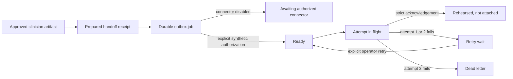

# PERL delivery outbox contract

## Decision

PERL now commits every prepared source-linked clinician attachment to a durable local outbox. The outbox is deliberately separate from report approval, attachment preparation, and the future e-QPASS connector.

The default connector is disabled. It performs no network request, creates no attempt, and claims no attachment. A connector can run only when code injects both a transport and an explicit `approved-for-synthetic-calibration` authorization object. Environment variables, URLs, and credentials cannot activate it implicitly.

This is an executable integration rehearsal, not the authoritative e-QPASS contract and not a PHI-approved delivery service.

## Contracts

| Contract | Version | Purpose |
|---|---|---|
| Durable outbox | `perl-delivery-outbox/1.0` | Bind one delivery job to one approved artifact and one preparation receipt |
| Connector request | `perl-attachment-delivery-request/0.1` | Send a bounded synthetic rendered attachment with exact lineage and idempotency |
| Connector acknowledgement | `perl-attachment-delivery-ack/0.1` | Confirm a synthetic rehearsal while explicitly denying a production remote-write claim |

Published schemas:

- [delivery-job.schema.json](../schemas/delivery-job.schema.json)
- [delivery-event.schema.json](../schemas/delivery-event.schema.json)
- [delivery-request.schema.json](../schemas/delivery-request.schema.json)
- [delivery-acknowledgement.schema.json](../schemas/delivery-acknowledgement.schema.json)

## Lifecycle



No transition means “attached.” The terminal success state is `rehearsed-not-attached` and its acknowledgement must include `remoteWriteClaimed: false`.

## Job binding

One immutable job binds:

- the visibly synthetic assessment reference;
- the source-event receipt hash;
- the approved report artifact ID and hash;
- the preparation receipt hash;
- the exact rendered-content hash;
- one stable synthetic idempotency key; and
- a maximum of three attempts.

The active-job map prevents an earlier artifact from running after a clinician edit, re-review, or replacement approval. The connector request is rebuilt from the immutable approved artifact and validated against the preparation hash immediately before an attempt.

## Attempt and failure semantics

1. PERL persists `delivery-attempted` before calling the connector.
2. A valid acknowledgement is schema-exact, request-bound, idempotency-bound, visibly synthetic, and cannot claim a remote write.
3. Timeouts, malformed acknowledgements, and connector failures are converted to bounded error codes. Endpoint, credential, and raw transport details are not persisted or returned.
4. Attempts one and two enter `retry-wait`; retry requires an explicit operator action.
5. Attempt three enters `dead-lettered`. The current sandbox does not silently reset the attempt budget.
6. If the process stops while an attempt is in flight, startup records `DELIVERY_INTERRUPTED` and schedules idempotent review without assuming whether a remote system wrote anything.

Every job and state transition is bound into the schema-15 delivery ledger. Startup fails closed if a job, event, link, active mapping, artifact reference, preparation reference, or hash has changed.

## Connector activation

The candidate connector requires all of the following in process memory:

```js
createDeliveryConnector({
  connector: "structured-candidate",
  authorization: {
    status: "approved-for-synthetic-calibration",
    connectorId: "named-connector",
    connectorVersion: "fixed-version",
    approvedBy: "named-authority"
  },
  transport: async (request, { signal }) => acknowledgement
});
```

Even this candidate remains `phiApproved: false`, `authoritativeContract: false`, and `approvalScope: synthetic-calibration-only`.

## Production replacement evidence

The production connector cannot be derived from this RFI rehearsal. The e-QPASS, clinical, privacy, security, and engineering owners must supply and approve:

1. the authoritative service or event contract and authenticated service identity;
2. exact PDF generation, merge, placement, and unchanged-Findings behavior;
3. acknowledgement semantics, idempotency retention, and uncertain-outcome reconciliation;
4. rescore, supersession, withdrawal, and replacement behavior;
5. transactional outbox storage, worker leases, concurrency, retry intervals, and dead-letter alerting;
6. PHI classification, encryption, logs, metrics, retention, backup, and recovery controls;
7. role authorization and operator runbooks; and
8. end-to-end evidence that a named pilot record contains both the unchanged Findings report and the approved PERL page.

Until those items exist, the Governance view truthfully shows a durable package held at the connector boundary.
