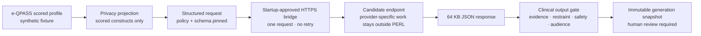

# PERL HTTPS model transport bridge

Contract: `perl-https-model-transport/1.0`  
Policy: `perl-model-transport-policy/1.0`  
State schema: `sandbox-state/42`  
Package: `perl-synthetic-calibration-package/2.26`

## Outcome

PERL can now connect its existing structured candidate gateway to one real HTTPS model endpoint without putting an endpoint, credential, provider-specific response shape, or fallback rule inside the clinical workflow. The normal server still runs the deterministic baseline and makes no external request. A candidate bridge exists only when an owner provisions a current private policy file at startup and supplies the named credential through a dedicated environment variable.

This is an executable transport boundary, not provider approval or clinical validation. Its only permitted scope is synthetic calibration.

## Requirements fixed by source direction

Dolores's January 12, 2026 product update calls for selecting candidate engines, manually testing common documents, using live counselor review, modifying from feedback, and only then automating the Findings-report round trip. Her August 13, 2026 update confirms that the counselor-summary add-on remains the provider-side priority and that reviewers are available. The July 2026 proposal similarly requires model calibration and human-versus-AI comparison before e-QPASS integration.

That sequence creates five transport requirements:

1. candidates must cross the same scoring-only input boundary;
2. one engine failure must remain visible rather than silently changing engines;
3. the candidate must return the same strict four-audience and interpretation bundle;
4. credentials and endpoints must not enter product state, browser storage, exports, logs, or error messages; and
5. connecting a candidate must not imply PHI, provider, clinical, pilot, or production approval.

## High-level design

The bridge deliberately terminates at a stable PERL-native JSON contract. An internal Azure gateway, private provider adapter, or other approved service can translate that contract into a provider-specific API without coupling provider SDKs, model names, or vendor credentials to the clinician product.

## Startup policy

Set `PERL_MODEL_TRANSPORT_POLICY_FILE` to a regular JSON file with mode `0600` or stricter. The file must validate against [model-transport-policy.schema.json](../schemas/model-transport-policy.schema.json) and include:

- one specific HTTPS endpoint path with no embedded credentials, query, or fragment;
- a current issued/expiry window;
- `approved-for-synthetic-calibration` as the only accepted status;
- a 500–30,000 millisecond timeout;
- a 16–256 KB request ceiling;
- the name of a dedicated `PERL_MODEL_*_TOKEN` environment variable; and
- pinned provider, model, prompt, and governance references.

The secret value is read from that environment variable at startup. It is held in the transport closure only and is never returned by `describe()`, `/api/model/status`, health output, a generation snapshot, or an export.

## Request behavior

The bridge performs exactly one `POST` with redirect following disabled. It sends:

- `Authorization: Bearer …` from the startup environment;
- `Idempotency-Key` equal to the ephemeral generation request UUID;
- the request contract and request ID in bounded headers;
- the transport-policy fingerprint, not the policy or endpoint; and
- the existing `perl-structured-generation-request/0.1` JSON body.

The body still contains only the scoring projection. Tenant, subject, assessment, report, correlation, reviewer, demographic, examiner, raw-response, Findings-PDF, and contact fields remain outside it.

## Response and failure behavior

The remote endpoint must return a successful JSON response. PERL rejects:

- redirects;
- non-success HTTP status;
- non-JSON media types;
- a declared or streamed body larger than 64 KB;
- malformed JSON;
- undeclared response fields;
- diagnostic certainty;
- invented evidence references;
- critical-screen omissions;
- clinical detail in the administrative format; or
- output that fails any existing narrative or interpretation rule.

The outer generation timeout aborts the network request. There is no retry, alternate-engine failover, or deterministic fallback. A rejected or unavailable candidate creates no reviewable generation snapshot.

## Status surface

`GET /api/model/status` now exposes a sanitized transport object. It reports the contract, policy and endpoint fingerprints, current-policy state, credential availability, byte/time bounds, zero retries, disabled fallback, and false PHI/provider/clinical claims. It omits the endpoint, credential value, environment-variable name, and policy identifier.

The integration view labels the provider link `HTTPS bridge armed` only when that transport is active. The existing gold/forest editorial system, keyboard semantics, and responsive card behavior remain unchanged.

## Reliability and scale

This milestone uses one bounded synchronous request because generation already occurs before the review snapshot is committed. At higher volume, the production design should put the bridge behind a transactional work queue with worker leases, per-candidate concurrency limits, rate-limit telemetry, circuit breaking, and an immutable attempt ledger. Those additions must preserve the same request ID, frozen input, no-fallback rule, and human approval boundary.

## Tradeoffs and revisit triggers

- **Stable internal contract over direct vendor SDKs.** This prevents provider churn from changing clinical code, but an approved adapter service is still needed for each shortlisted engine.
- **Bearer environment secret over embedded configuration.** This removes persistence and API exposure, but production should replace it with managed identity or Key Vault-backed short-lived credentials.
- **No automatic retry.** This makes candidate comparison and failure attribution honest. A production queue may add bounded retries only after idempotency and outcome-reconciliation behavior are accepted.
- **Synthetic-only activation.** This permits engineering connection tests without claiming a BAA, privacy approval, or PHI path. Any broader data class requires an approved provider architecture, legal/privacy decision, private networking evidence, retention/deletion terms, monitoring, and independent clinical validation.

Revisit the bridge before any named-site pilot, provider/model version change, prompt change, response-contract change, credential strategy change, retry/failover addition, or transmission of a non-synthetic record.

## Remaining external decisions

The transport does not choose the three engines Dolores requested. Named product, engineering, clinical, security/privacy, legal, counselor-panel, and independent-review owners must still:

1. name the three exact provider/model/version candidates;
2. approve each provider's privacy, security, retention, training-use, region, and BAA position;
3. provision three separately scoped adapters and credentials;
4. authorize synthetic transports into the Candidate Trial Foundry;
5. run the frozen blinded counselor evaluation; and
6. sign the scoped selection before any de-identified clinical or production use.
