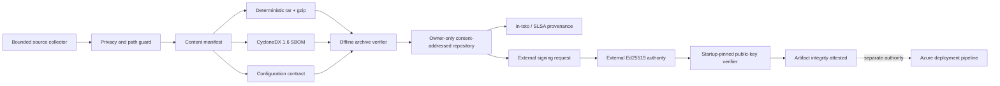

# PERL release candidate foundry

Contract: `perl-release-candidate/1.0`

Current package export: `perl-synthetic-calibration-package/2.36` (Foundry introduced in `2.27`)

## Decision

PERL now produces a real, self-contained software release candidate instead of treating the working tree as a deployable artifact. The candidate is content addressed, byte reproducible, independently verifiable, PHI excluding, and accompanied by a CycloneDX 1.6 SBOM, an in-toto/SLSA provenance statement, an exact startup-configuration contract, and an external Ed25519 signing request.

This closes the local packaging gap. It does not claim a production signature, Azure deployment, e-QPASS connection, clinical validation, clinical release, traffic activation, or patient use.

## Requirements

### Functional

- collect the complete runnable application, tests, schemas, documentation, and pinned synthetic render evidence;
- exclude runtime state, workspace mail/documents, unpinned QA material, old build output, credentials, private keys, and production records;
- normalize archive paths, owner/group IDs, modes, timestamps, ordering, and gzip metadata so identical source produces identical bytes;
- bind every source file, the configuration contract, and the SBOM into the artifact identity;
- verify the archive without extracting it to disk;
- write content-addressed, owner-only, read-only candidate files;
- expose archive, manifest, configuration, SBOM, provenance, and signing-request downloads;
- optionally verify an externally created Ed25519 signature against one owner-only startup policy without accepting a private key.

### Non-functional

- maximum 512 files, 4 MB per file, 32 MB source, and 48 MB compressed archive;
- no symbolic links, non-regular entries, duplicate paths, traversal paths, undeclared archive content, or overwrite-on-conflict;
- deterministic and idempotent builds;
- fail closed on digest, tar-header, aggregate, metadata, signature, identity, time-window, or authority-claim mismatch;
- default repository and trust policy disabled until used; no outbound network activity.

## Architecture



## Archive contents

The deterministic archive contains:

- top-level browser/server runtime files and `package.json`;
- `assets/`, `docs/`, `examples/`, `schemas/`, `src/`, `tests/`, and `tools/`;
- the exact report-render evidence manifest, three pinned synthetic screenshots, and the pinned synthetic Letter PDF needed by the regression suite;
- `release/manifest.json`;
- `release/configuration.json`;
- `release/sbom.cdx.json`.

It excludes `data/`, `dist/`, unpinned `qa/`, unpinned `output/`, hidden files, symlinks, policy instances, credentials, and any private key.

The build receipt, provenance statement, signing request, and any verified-signature record are sidecars. Build time and actor stay in the receipt so they do not make the archive nondeterministic.

## Identity and verification

The source digest is SHA-256 over the canonical ordered sequence of path, size, and file digest. The artifact ID also binds the configuration and SBOM digests:

`perl-rc-<first 20 hex characters of identity digest>`

The verifier reads the gzip and tar structures in memory, validates every tar checksum and path, rejects undeclared entries, validates all false authority claims, recomputes every file digest and aggregate, and recomputes the artifact ID. It performs no filesystem extraction.

## External signature boundary

`PERL_RELEASE_TRUST_POLICY_FILE` may point to an owner-only JSON policy containing one current Ed25519 public key. PERL accepts no private key. A valid envelope must bind the exact archive, manifest, provenance, and SBOM digests; use the fixed artifact-integrity purpose; remain inside both policy and signature windows; and keep deployment, clinical release, traffic activation, and patient-use authority false.

The verified signature proves only that the configured external release authority attested the exact candidate bytes. Production deployment and clinical authorization remain separate duties in the Pilot-Start, Clinical Release, and Traffic Activation contracts.

## API

| Method | Route | Behavior |
|---|---|---|
| `GET` | `/api/operations/release` | Sanitized repository, latest-candidate, trust, and authority status |
| `POST` | `/api/operations/release/build` | Build or idempotently resolve the exact current candidate |
| `GET` | `/api/operations/release/candidates/:id/archive` | Download the verified tar/gzip archive |
| `GET` | `/api/operations/release/candidates/:id/manifest.json` | Download the exact content manifest |
| `GET` | `/api/operations/release/candidates/:id/configuration.json` | Download the startup contract |
| `GET` | `/api/operations/release/candidates/:id/sbom.cdx.json` | Download CycloneDX 1.6 evidence |
| `GET` | `/api/operations/release/candidates/:id/provenance.json` | Download in-toto/SLSA provenance |
| `GET` | `/api/operations/release/candidates/:id/signing-request.json` | Download the external signing request |
| `POST` | `/api/operations/release/signatures/verify` | Verify and pin an externally produced signature when trust is configured |

## Operator commands

```bash
npm run release:build
npm run release:verify
npm run release:qualify
```

The build command writes to `dist/releases` for engineering handoff. The live local app uses the owner-only `data/releases` repository by default, configurable with `PERL_RELEASE_REPOSITORY_DIR`.

The qualification command passes the exact archived application through the separate [Release Admission Laboratory](./RELEASE_ADMISSION_LAB.md). It does not change or authorize the candidate.

## Reliability and scale

Build work is single-flight per process. Candidate identity is content addressed, immutable writes use temporary files plus atomic rename, an existing candidate must match exactly, and every read re-verifies the archive before it is served. This is appropriate for a low-volume release workflow and a small dependency-free Node application.

At larger scale, move candidate storage to an immutable artifact registry, execute builds in isolated ephemeral workers, replace local actor codes with workload identity, emit signed SLSA provenance from CI, add vulnerability/license policy and transparency-log evidence, and replicate artifacts across approved regions. Download serving should move to authenticated, integrity-pinned object storage rather than the application process.

## Trade-offs

- A small in-repository tar implementation removes packaging dependencies and makes normalization inspectable, but it intentionally supports regular files only.
- File-level CycloneDX components maximize exactness for this dependency-free build, but a future dependency graph should also include resolved package/container and operating-system components.
- The archive is deployable as software but not authorized for production. Keeping those concepts separate avoids making an unsigned local build look approved.
- The release repository is outside the synthetic state ledger. Content addressing and verification protect artifact integrity; production audit retention still belongs in CI and the artifact registry.

## Revisit triggers

Revisit this design when PERL gains third-party dependencies, a container image, compiled assets, database migrations, multiple services, production PHI authorization, remote artifact storage, or an Azure deployment pipeline. Those changes require a locked dependency graph, container/image SBOM, vulnerability policy, migration compatibility evidence, signed CI provenance, registry retention, and staged deployment/rollback proof.
