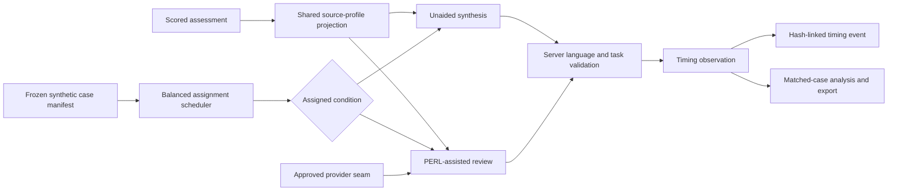

# PERL matched workflow timing design

## Decision

PERL needs a separate workflow-timing study. The existing blind-comparison timer measures how long a reviewer evaluates two finished summaries. It cannot establish how much time a counselor saves when producing a usable clinician summary.

The timing study therefore measures the same output task under two conditions:

1. **Unaided synthesis:** the reviewer receives the scored source profile and writes a clinician summary without generated prose.
2. **PERL-assisted review:** the reviewer receives the same scored source profile plus a PERL draft, then verifies and revises the final clinician summary.

The synthetic sandbox rehearses assignment, capture, integrity, analysis, and export. It does not produce a time-saving claim.

## Requirements

### Functional

- Issue or resume one timed task per reviewer.
- Use only assignment-enabled cases from the frozen manifest.
- Expose the same scored-source projection in both conditions.
- Never expose a PERL draft in the unaided condition.
- Prevent the same reviewer from seeing the same case in both timing conditions.
- Balance condition coverage within each case and across the study.
- Measure wall time on the server and subtract enforced study pauses.
- Preserve every timing, including observations outside the protocol window.
- Apply the same non-diagnostic language guard to both final summaries.
- Record task, source, model, manifest, reviewer, timing, and output provenance.
- Commit every completed observation to a linked integrity event before returning success.
- Export raw observations and matched-case descriptive analysis.

### Non-functional and safety

- Synthetic data only; no production identifier or PHI path.
- No client-supplied duration is trusted.
- Issuance and submission stop during an unresolved high or critical incident.
- A retry resumes the existing pending assignment instead of issuing a new one.
- Pending assignments expire after four hours.
- The current local SHA-256 chain is tamper evidence, not authentication, authorization, or immutable production storage.

## Data flow

## Assignment model

For each reviewer, eligible candidates exclude any assessment already completed by that reviewer in the workflow-timing study. Among the remaining reviewer/case combinations, the scheduler ranks the condition with lower coverage for that case, then lower total condition coverage, then lower total case coverage. A stable hash of the reviewer code, case ID, and current allocation breaks exact ties.

This creates case-level overlap across independent reviewers while preventing within-reviewer case repetition and obvious carryover. It does not guarantee randomization in a statistical sense. A production protocol should use a frozen seeded allocation schedule prepared by the independent evaluator.

## Stored observation

Each completed task records:

- task ID and `workflow-timing-v1` contract;
- condition: `unaided` or `perl-assisted`;
- synthetic assessment ID and scored-source hash;
- manifest ID/version, partition, strata, source version, and reference version;
- bounded reviewer code;
- assigned/submitted times, raw/paused/active seconds, eligibility, and flag;
- final clinician summary;
- initial draft hash and changed-token count only for assisted tasks;
- provider ID/version only for assisted tasks;
- explicit synthetic and non-validation boundaries.

Pending assignments may contain the assisted draft so a reviewer can resume. Pending assignments and draft content are never exported.

## API

| Method | Route | Behavior |
|---|---|---|
| `GET` | `/api/calibration/timing/next` | Resume the reviewer’s pending task or allocate a new balanced condition/case |
| `POST` | `/api/calibration/timing` | Validate and commit the final summary, compute server timing, append its integrity event |
| `GET` | `/api/calibration/timing/export.csv` | Export spreadsheet-safe completed timing observations only |
| `GET` | `/api/calibration/analysis` | Include condition distributions, matched-case differences, readiness, and limitations |

## Analysis

All observations are retained. The protocol-eligible window remains 30 seconds through 45 minutes. The study reports:

- all-observed and eligible duration distributions for each condition;
- flagged and paused counts;
- assisted changed-token distribution;
- number of cases represented in both conditions;
- for each matched case, mean unaided minutes, mean assisted minutes, difference in minutes, and percent difference;
- a descriptive distribution of case-level differences.

The mechanical timing gate requires at least 30 eligible observations per condition, at least 20 matched cases, complete case-set strata, and no unresolved high or critical incident. Threshold attainment only means that the package is ready for the predeclared analysis. It does not establish time saved.

## Error and retry behavior

- A missing, expired, already-submitted, or wrong-reviewer task returns a conflict.
- An invalid or diagnostic summary is rejected while the pending task remains resumable.
- A study pause returns a locked response and preserves the pending task.
- Duplicate successful submission is rejected because the pending task is removed only after the completed observation and integrity event are built.
- Startup rejects altered observation content, duplicate event linkage, or a broken event chain.

## Tradeoffs

- **Case-level matching across reviewers** avoids showing the same case twice to one reviewer, but introduces reviewer-level variability. The production plan should balance reviewer exposure and may model reviewer and case effects.
- **Server wall time** is auditable and simple, but includes unrecorded interruptions. The window and flags preserve rather than hide that limitation.
- **Scored-profile rehearsal** makes the local workflow testable without PHI, but is not the full e-QPASS Findings interface. Production timing must use the approved source presentation.
- **Hash-linked local events** make accidental or retrospective mutation visible, but do not provide identity, trusted time, signatures, or immutable retention.

## What to revisit at production scale

- independent-evaluator seeded randomization and allocation concealment;
- authenticated licensed reviewer identity;
- exact source Findings interface and task instructions;
- interruption capture and withdrawal handling;
- multi-level analysis for reviewer and case effects;
- trusted event time, immutable storage, monitoring, and recovery;
- minimum detectable effect and power analysis frozen before results are opened.
